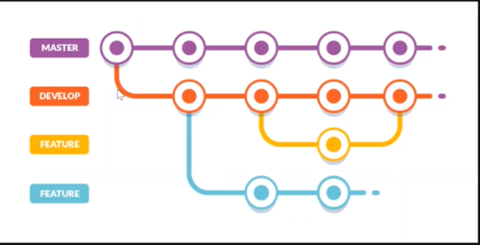

# Clase 04
## Ramas o branches



### Crear una rama

```sh
git branch <nombre-rama>
```

### Listar una rama

```sh
git branch
```

### Cambiar entre ramas

```sh
git switch <nombre-rama>
```
### Borrar rama

```sh
git branch -d <nombre-rama>
```

### Subir rama al remoto
```sh
git push -u origin <nombre-rama>
```

### Clonar un proyecto
```sh
git clone <ruta-copiada> . # el punto le indica al clone que no cree un directorio nuevo, sino que cree en el directorio actual
```